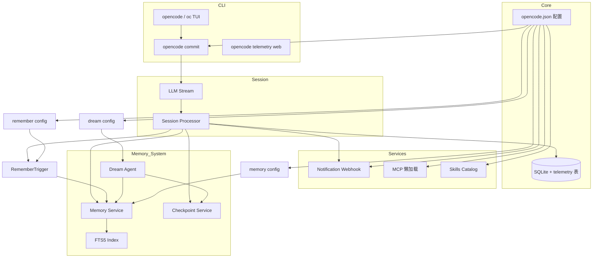
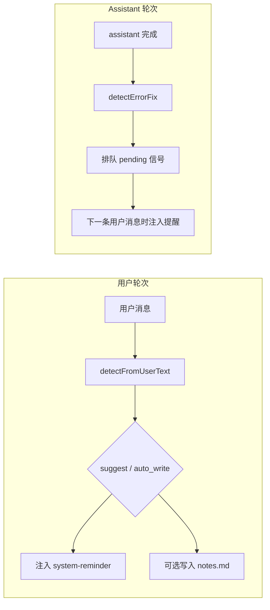

# OpenCodeX 变更说明

本文档基于 `dev` 分支从提交 `8864c612`（含）到 `8c7fa0f1`（HEAD）的 Git 历史整理，涵盖 7 个提交、74 个文件、约 5000+ 行新增代码。

## 提交概览

| 提交 | 类型 | 摘要 |
|------|------|------|
| `8864c612` | feat | 遥测、AI 提交信息生成、通知系统 |
| `be9e6bd9` | feat | MCP 懒加载、`include_tools`、Skills 目录模式 |
| `9633855b9` | feat | `commit --push` 与未暂存变更处理改进 |
| `9436822de` | feat | CLI 主题支持与 commit 输出样式 |
| `948d4bb6a` | feat | OpenCode → OpenCodeX 品牌重塑 |
| `bd2e1011c` | fix | 使用 `OPENCODE_ORIG_CWD` 解析线程目录 |
| `8c7fa0f1d` | feat | `task_interrupted` 通知事件与中止错误处理 |

---

## 1. 本地安装与开发环境

新增根目录脚本 `install-opencodex.sh`，一键完成开发环境搭建：

- 执行 `bun install --ignore-scripts` 安装依赖
- 生成 `packages/opencode/bin/opencode-dev` 包装脚本，启动前设置 `OPENCODE_ORIG_CWD` 为调用时的工作目录
- 在 `~/bin` 创建 `ocx` 软链接

```bash
./install-opencodex.sh
ocx
```

开发版本号格式为 `dev-{version}+{sha}`（见 `packages/core/src/installation/source-version.ts`），便于区分源码构建与发布版本。

---

## 2. 遥测系统（Telemetry）

### 功能

在本地 SQLite 数据库中持久化性能与使用数据，并提供 Web 仪表盘实时查看。

**采集事件：**

| 事件 | 说明 |
|------|------|
| `llm.completion` | LLM 调用（token 用量、耗时、成本等） |
| `tool.used` | 工具调用 |
| `turn.completed` | 单轮对话完成 |
| `cli.start` / `cli.exit` | CLI 启动与退出 |

**接入点：** Session 处理器（`processor.ts`、`prompt.ts`）在 LLM 流式完成、工具执行、轮次结束时自动上报。

### CLI

```bash
opencode telemetry web [--port 4312] [--hostname 127.0.0.1] [--interval 2000] [--open]
```

- 默认在 `http://127.0.0.1:4312` 启动仪表盘
- 支持深色/浅色主题切换
- 展示 LLM 调用统计、工具使用、轮次耗时等

### 禁用

设置环境变量 `OPENCODE_DISABLE_TELEMETRY=1` 或 `true` 可关闭采集。

### 数据库

新增迁移 `20260611113000_telemetry.ts`，在 `telemetry` 表中存储事件记录。

---

## 3. AI 提交信息生成（Commit）

### CLI 命令

```bash
opencode commit [options]
```

| 选项 | 说明 |
|------|------|
| `--dir <path>` | 指定工作目录 |
| `--all` | 无暂存变更时，自动 stage 已跟踪文件 |
| `--include-untracked` | 无暂存变更时，包含未跟踪文件 |
| `--message <msg>` | 直接使用给定信息，跳过 AI 生成 |
| `--previous <msg>` | 重新生成时排除的上一条信息 |
| `--yes` | 跳过确认直接提交 |
| `--push` | 提交后推送到远程；无变更时可选择仅 push |
| `--dry-run` | 仅预览，不创建提交 |

**交互流程：** 分析 git 状态 → AI 生成 Conventional Commits 格式信息 → 预览（提交/编辑/重新生成/取消）→ 执行 `git commit`，可选 `git push`。

**未暂存变更处理：**

- `--yes` 或 `--push` 在无 staged 文件时自动启用 `--all` 行为
- 锁文件（如 `package-lock.json`）单独变更会被排除并提示
- 无可用变更时，`--push` 可触发「是否推送当前分支」确认

### TUI 插件

内置 TUI 插件 `internal:opencode-commit`（`packages/opencode/src/plugin/tui/commit.tsx`），在终端 UI 中提供与 CLI 等价的提交交互（对话框预览、编辑、确认）。

### 配置

在 `opencode.json` 中可配置：

```json
{
  "commit_message": {
    "prompt": "自定义 system prompt（完全替换默认 Conventional Commits 提示）",
    "model": "anthropic/claude-haiku-4-5"
  }
}
```

- `model` 未设置时回退到 `small_model`，再回退到默认 `model`
- 基于 git diff 上下文生成，支持 monorepo scope 推断

---

## 4. 通知系统（Webhook）

### 功能

监听 Session 状态、权限请求、问答等事件，通过 Webhook 推送通知（默认适配飞书机器人 JSON 格式）。

**支持的事件：**

| 事件 | 触发场景 |
|------|----------|
| `task_completed` | 任务正常完成（busy → idle） |
| `task_error` | 执行出错 |
| `task_interrupted` | 用户中止（`MessageAbortedError`） |
| `permission_required` | 需要权限确认 |
| `question_required` | 需要用户回答 |
| `session_error` | 会话级错误 |

通知内容包含：项目名、终端名、Session 标题、最近用户消息摘要、时间戳。

### 配置

```json
{
  "notification": {
    "enabled": true,
    "webhookUrl": "https://open.feishu.cn/open-apis/bot/v2/hook/...",
    "notify_action": "webhook",
    "enabled_events": ["task_completed", "task_error", "task_interrupted"],
    "disabled_events": []
  }
}
```

- `enabled_events`：白名单；未设置时使用全部默认事件
- `disabled_events`：黑名单，优先级高于白名单
- 终端类 Session（有 `parentID`）的完成/错误/中断事件会被跳过，避免子任务重复通知
- 终态通知有 1 秒防抖与 5 秒去重

### 接入

`opencode serve` 与 TUI worker 启动时自动调用 `setupNotification()`。

---

## 5. MCP 增强

### 懒加载（`lazy`）

MCP 服务器可配置 `lazy: true`，启动时不连接，状态为 `idle`，仅在以下时机按需连接：

- `mcp_connect` 工具调用
- `opencode mcp connect <name>` CLI
- TUI `/mcp connect` 命令

适用于工具较多或不常使用的 MCP 服务，减少启动开销。

### 工具过滤（`include_tools`）

`include_tools: false` 时保持连接，但不将工具 schema 注入 LLM 请求，降低 token 消耗。默认 `true`。

### Profile 过滤

通过 `mcp_profile` 与 `mcp_profiles` 按 profile 名称筛选启用的 MCP 服务器。

### 状态显示

MCP 状态新增 `idle` 指示，区分已配置未连接与已连接服务器。

### Agnes AI 多媒体生成工具

配置 Agnes AI MCP server 后，可通过 TUI 命令快捷调用图片和视频生成能力。

**MCP 配置：**

```json
{
  "mcp": {
    "agnes-ai": {
      "type": "local",
      "command": ["node", "/Users/junx/.config/opencode/plugins/agnes-ai-mcp/dist/index.js"],
      "env": {
        "AGNES_API_KEY": "{env:AGNES_API_KEY}"
      },
      "lazy": true
    }
  }
}
```

需要提供环境变量 `AGNES_API_KEY`。MCP server 提供以下工具：

| 工具 | 功能 | 参数 |
|------|------|------|
| `agnes_generate_image` | 生成图片 | `prompt`（必填）、`model`（默认 agnes-image-2.1-flash）、`size`（默认 1024x1024）、`n`（默认 1） |
| `agnes_generate_video` | 生成视频 | `prompt`（必填）、`model`（默认 agnes-video-v2.0）、`duration`（默认 5 秒）、`size`（默认 1280x720） |
| `agnes_list_models` | 列出可用模型 | 无 |

**TUI 快捷命令：**

在 opencode TUI 中使用 `/image` 或 `/video` 命令：

```
# 生成图片
/image 一只猫坐在窗台上

# 生成视频
/video 海浪拍打海岸
```

**模型注册：**

在 `provider` 中注册模型元信息，配置 `modalities` 标识多模态能力：

```json
{
  "provider": {
    "agnes-ai": {
      "models": {
        "agnes-image-2.1-flash": {
          "name": "agnes-image-2.1-flash",
          "modalities": {
            "input": ["text"],
            "output": ["image"]
          }
        },
        "agnes-video-v2.0": {
          "name": "agnes-video-v2.0",
          "modalities": {
            "input": ["text"],
            "output": ["video"]
          }
        }
      }
    }
  }
}
```

> **注意：** agnes-image-2.1-flash 和 agnes-video-v2.0 是生成型模型（图片/视频），不是对话模型。推荐通过 MCP tools 调用，而不是直接设为 `model`。

---

## 6. Skills 目录模式

在 `skills.catalog` 中控制技能列表如何注入系统提示：

| 模式 | 行为 |
|------|------|
| `compact`（默认） | 注入技能名与描述，省略文件路径 |
| `verbose` | 包含完整路径信息 |
| `none` | 不写入系统提示，将目录移至 `skill` 工具描述中 |

适用于控制 context 长度与技能可发现性的平衡。

---

## 7. CLI 主题支持

新增 `packages/opencode/src/cli/theme.ts`，CLI 命令（尤其 `commit`）复用 TUI 主题配色：

- 从项目 `.opencode` 目录向上查找主题配置
- 支持 TUI 主题 JSON 与内置主题
- 尊重 `NO_COLOR` 环境变量
- commit 输出区分：成功（绿）、信息（灰）、警告、危险等语义色

---

## 8. 品牌重塑：OpenCode → OpenCodeX

TUI 全面更新品牌标识：

- 终端标题：`OpenCode` → `OpenCodeX`
- 版本徽章：`Code` → `CodeX`
- 音效包：`OpenCodeX Default`
- 提示文案与权限对话框引用 OpenCodeX
- Logo ASCII 艺术字更新，统一从 `packages/tui/src/logo.ts` 导入

---

## 9. 工作目录修复（OPENCODE_ORIG_CWD）

**问题：** 通过 `opencode-dev` 启动时，进程 `cwd` 被切换到 `packages/opencode`，导致 TUI 线程目录解析错误。

**修复：**

- 包装脚本设置 `OPENCODE_ORIG_CWD="$(pwd)"` 记录用户实际工作目录
- `resolveThreadDirectory()` 优先使用 `OPENCODE_ORIG_CWD`
- `invocationDirectory()` 用于 `commit --dir` 等相对路径解析

---

## 10. 日志增强

`packages/core/src/util/log.ts` 扩展结构化日志能力，为遥测、通知、提交信息等模块提供统一日志服务。

---

## 配置示例（汇总）

```json
{
  "commit_message": {
    "model": "anthropic/claude-haiku-4-5"
  },
  "notification": {
    "enabled": true,
    "webhookUrl": "https://example.com/webhook",
    "enabled_events": ["task_completed", "task_interrupted"]
  },
  "skills": {
    "catalog": "compact"
  },
  "mcp": {
    "my-server": {
      "type": "local",
      "command": ["npx", "-y", "some-mcp-server"],
      "lazy": true,
      "include_tools": true
    }
  }
}
```

---

## 测试覆盖

本区间新增/扩展测试：

| 模块 | 测试文件 |
|------|----------|
| 遥测 | `telemetry/query.test.ts`、`server.test.ts`、`setup.test.ts` |
| 提交 | `commit-command.test.ts`、`commit-message/generate.test.ts`、`git-context.test.ts` |
| 通知 | `notification/webhook.test.ts` |
| MCP | `mcp/lifecycle.test.ts` |
| CLI 主题 | `cli/theme.test.ts` |
| TUI 线程目录 | `cli/tui/thread.test.ts` |
| TUI 提交插件 | `plugin/tui-commit-plugin.test.ts` |
| Skills 系统提示 | `session/system.test.ts` |
| `/remember` 命令 | `command/remember.test.ts` |
| `/checkpoint` 命令 | `command/checkpoint.test.ts` |
| 自动记忆 | `session/remember-trigger.test.ts` |

---

## 架构关系



---

## 11. 记忆系统（Memory）

### 功能概述

基于 FTS5 全文搜索的记忆系统，支持跨会话知识持久化和检索。

**核心组件：**

| 模块 | 路径 | 功能 |
|------|------|------|
| Memory Service | `packages/core/src/memory/service.ts` | BM25 搜索、索引、同步 |
| Memory FTS | `packages/core/src/memory/sql.ts` | FTS5 虚表定义 |
| Memory Paths | `packages/core/src/memory/paths.ts` | 文件路径解析 |
| Memory Tool | `packages/core/src/tool/memory.ts` | LLM 调用工具 |

### 数据模型

**FTS5 表结构（memory_fts）：**

```ts
{
  id: integer().primaryKey(),
  path: text().notNull().unique(),      // 文件绝对路径
  scope: text().notNull(),               // 作用域: global | projects | sessions | cc
  scope_id: text().notNull().default(""),// 作用域ID
  type: text().notNull(),                // 类型: memory | checkpoint | progress | notes | free
  body: text().notNull(),                // 文件全文内容
  fingerprint: text().notNull(),         // 文件指纹 (size-mtimeMs)
  last_indexed_at: integer().notNull(),  // 最后索引时间
}
```

**记忆类型：**

| 类型 | 说明 | 文件路径示例 |
|------|------|-------------|
| `memory` | 项目记忆 | `<DATA>/memory/projects/<projectID>/MEMORY.md` |
| `checkpoint` | 会话检查点 | `<DATA>/memory/sessions/<sessionID>/checkpoint.md` |
| `progress` | 任务进展 | `<DATA>/memory/sessions/<sessionID>/tasks/<taskID>/progress.md` |
| `notes` | 自由笔记 | `<DATA>/memory/sessions/<sessionID>/notes.md` |
| `global` | 全局记忆 | `<DATA>/memory/global/MEMORY.md` |
| `free` | 自由形式 | 用户自定义路径 |

### 搜索机制

**BM25 全文搜索：**

- OR 连接词项，保证召回率
- BM25 排序，稀有词权重更高
- 相对分数底线过滤噪声（默认 0.15）
- 支持按 scope/scope_id/type 过滤

**工具调用示例：**

```ts
memory.search({
  query: "authentication flow",
  scope: "projects",
  scope_id: projectID,
  type: "memory",
  limit: 10,
})
```

### 配置

```json
{
  "remember": {
    "auto": true,
    "suggest": true,
    "auto_write": false
  },
  "checkpoint": {
    "memory_reconcile_on_search": true,
    "memory_search_score_floor": 0.15,
    "push_caps": {
      "checkpoint": 11000,
      "memory": 10000,
      "notes": 6000,
      "global": 6000
    }
  }
}
```

主动写入记忆见 [§19 自动记忆（remember.auto）](#19-自动记忆rememberauto) 与 `/remember` 命令。

---

## 12. Checkpoint 系统

### 功能概述

Session 状态快照系统，在 token 越界或手动触发时保存当前工作状态。

**核心组件：**

| 模块 | 路径 | 功能 |
|------|------|------|
| Checkpoint Service | `packages/core/src/checkpoint/service.ts` | 写入/读取 checkpoint 和 MEMORY.md |
| Checkpoint Templates | `packages/core/src/checkpoint/templates.ts` | 11章节结构定义 |
| Checkpoint Paths | `packages/core/src/checkpoint/paths.ts` | 路径解析 |
| Trigger Logic | `packages/opencode/src/session/checkpoint-trigger.ts` | 触发检测 |

### Checkpoint 结构（11 章节）

```
## §1 Active intent           - 用户最新请求
## §2 Next concrete action    - 下一步行动
## §3 Directives (this session) - 会话级工作风格
## §4 Task tree               - 任务树
## §5 Current work            - 当前工作状态
## §6 Files and code sections - 活跃文件列表
## §7 Discovered knowledge    - 跨任务发现
## §8 Errors and fixes        - 错误和修复
## §9 Live resources          - 运行时状态
## §10 Design decisions       - 设计决策
## §11 Open notes             - 未分类内容
```

### MEMORY.md 结构（4 章节）

```
## Project context            - 项目身份和目标
## Rules                      - 用户硬性约束
## Architecture decisions     - 设计决策 + 理由
## Discovered durable knowledge - 跨会话持久事实
```

### 触发机制

- **自动触发（85%）：** 代码存在（`checkpoint-trigger.ts`）但**尚未接入**执行流
- **手动触发：** `/checkpoint`（subtask，运行时注入 `checkpointPath`）

---

## 13. Dream Agent

### 功能概述

记忆整合代理，定期分析会话轨迹，将临时知识整合为持久项目记忆。

**核心组件：**

| 模块 | 路径 | 功能 |
|------|------|------|
| Dream Prompt | `packages/opencode/src/agent/prompt/dream.txt` | 5阶段工作流提示词 |
| Auto Trigger | `packages/opencode/src/session/auto-dream.ts` | 自动触发调度逻辑 |
| Dream Command | `packages/opencode/src/command/template/dream.txt` | 命令说明 |

### 5阶段工作流

1. **定位数据** - 使用 memory 工具搜索关键词，定位 SQLite 数据库
2. **定向** - 读取 MEMORY.md、notes.md、最近 checkpoint.md
3. **收集** - 从 checkpoint/progress/notes 提取候选知识
4. **验证** - 对照原始会话轨迹验证候选事实
5. **整合** - 编辑 MEMORY.md，清理已处理的笔记文件

### 自动触发条件

- `dream.auto === true`（**默认 `false`**；loop 结束时按间隔自动 spawn `/dream` subtask）
- 距上次运行 ≥ `interval_days` 天（默认 7 天）
- 10秒防抖间隔

### 配置

```json
{
  "dream": {
    "auto": false,
    "interval_days": 7
  }
}
```

### 手动触发

```bash
# TUI 命令
/dream

# 或 CLI
opencode dream
```

---

## 14. Distill Agent

### 功能概述

工作流提取代理，分析历史会话，识别重复模式并生成可复用的技能、代理和命令。

**核心组件：**

| 模块 | 路径 | 功能 |
|------|------|------|
| Distill Prompt | `packages/opencode/src/agent/prompt/distill.txt` | 5阶段工作流提示词 |
| Auto Trigger | `packages/opencode/src/session/auto-distill.ts` | 自动触发调度逻辑 |
| Distill Command | `packages/opencode/src/command/template/distill.txt` | 命令说明 |

### 5阶段工作流

1. **定位数据** - 搜索最近 checkpoint 和 session 数据，查询 SQLite 历史
2. **模式识别** - 识别重复工具序列、常见任务类型、工作流结构
3. **提取候选** - 提取名称、触发条件、步骤序列、变体、前提条件
4. **生成制品** - 创建 `skills/`、`commands/`、`agents/` 配置文件
5. **验证清理** - 检查语法正确性，移除重复模式

### 与 Dream Agent 对比

| 特性 | Dream Agent | Distill Agent |
|------|-------------|---------------|
| **目的** | 记忆整合 | 工作流打包 |
| **间隔** | 7天 | 30天 |
| **输出** | 更新 MEMORY.md | 创建 skills/commands/agents |
| **依据** | 会话轨迹 + 记忆文件 | 重复工作流模式 |

### 自动触发条件

- `distill.auto === true`（**默认 `false`**；loop 结束时按间隔自动 spawn `/distill` subtask）
- 距上次运行 ≥ `interval_days` 天（默认 30 天）
- 10秒防抖间隔

### 配置

```json
{
  "distill": {
    "auto": false,
    "interval_days": 30
  }
}
```

### 手动触发

```bash
# TUI 命令
/distill

# 或 CLI
opencode distill
```

### 输出示例

```
## Distill Report

### Patterns Identified
- code-review-feedback-fix: 12 occurrences
- bug-report-investigate-fix: 8 occurrences
- feature-design-implement-test: 5 occurrences

### Artifacts Generated
- skills/code-review-workflow.txt
- commands/fix-bug.txt
- commands/review-pr.txt

### Recommendations
- Consider combining fix-bug and review-pr into a unified workflow
```

---

## 15. 新增命令

### 命令职责速查

| 需求 | 命令/工具 |
|------|-----------|
| 记一条 | `/remember` 或自然语言 + `remember.auto` |
| 搜记忆 | `memory` 工具（只读） |
| 整合 MEMORY.md | `/dream` |
| 会话快照 | `/checkpoint` |
| 提取工作流 | `/distill` |
| 省 token | DCP `/dcp`（插件） |

### `/dream` 命令

触发 Dream agent 进行记忆整合：

- 分析近期会话轨迹
- 提取持久化候选知识
- 验证并整合到 MEMORY.md
- 清理已处理的笔记文件

### `/checkpoint` 命令

subtask 写入 11 节 `checkpoint.md`：

- 运行时注入 `sessionID`、`checkpointPath`、相关记忆路径
- Agent 根据会话与 tool 历史更新快照
- 可用 `memory` 工具检索上下文；勿用 bash 探索记忆目录

### `/distill` 命令

触发 Distill agent 进行工作流提取：

- 分析过去30天的会话历史
- 识别重复工作流模式（3+ 次出现）
- 生成可复用的 skills 和 commands
- 验证生成的制品

### `/remember` 命令

将文本保存到持久记忆文件（默认写入**项目** `MEMORY.md`）：

```bash
/remember <text>                 # 默认：项目 MEMORY.md
/remember --session <text>       # 当前 session notes.md
/remember --global <text>        # 全局 MEMORY.md
```

**行为说明：**

- 空参数 `/remember` 仅返回用法提示，不启动完整 Agent 流程
- 运行时注入真实路径（`sessionID`、12 位 `projectMemoryID`、目标文件绝对路径），避免模板占位符未替换
- Agent 通过 `read`/`write`/`edit` 追加 dated bullet，可用 `memory` 工具检索已有内容
- `memory` 工具只读；写入靠文件工具完成

**记忆文件路径（macOS 示例）：**

```
~/Library/Application Support/opencode/memory/
├── global/MEMORY.md
├── projects/<12位projectID>/MEMORY.md
└── sessions/<sessionID>/notes.md
```

> `projectID` 由 worktree 路径 SHA256 前 12 位生成，**不是**数据库 `project.id`（40 位）。

---

## 19. 自动记忆（remember.auto）

### 功能概述

在用户未显式调用 `/remember` 时，自动检测「值得记住」的对话信号，并通过 `system-reminder` 提示 Agent 保存；可选自动写入 session 笔记。

**核心组件：**

| 模块 | 路径 | 功能 |
|------|------|------|
| Remember Trigger | `packages/opencode/src/session/remember-trigger.ts` | 信号检测、提醒注入、自动写入 |
| Remember Command | `packages/opencode/src/command/remember.ts` | 路径渲染与模板注入 |
| Remember Template | `packages/opencode/src/command/template/remember.txt` | Agent 执行指引 |

### 配置

```json
{
  "remember": {
    "auto": true,
    "suggest": true,
    "auto_write": false
  }
}
```

| 字段 | 默认 | 说明 |
|------|------|------|
| `auto` | `true` | 开启信号检测 |
| `suggest` | `true` | 注入 `<system-reminder>`，建议 Agent 使用 `/remember` 或写入记忆文件 |
| `auto_write` | `false` | 检测到信号后自动追加到 `sessions/<id>/notes.md` |

### 触发信号

| 类型 | 示例 | 默认目标 |
|------|------|----------|
| `user_request` | 「记住 DataTable 列要对齐」「remember this pattern」 | 项目 `MEMORY.md` |
| `user_rule` | 「以后都不要用 any」「必须始终…」「never use…」 | 项目 `MEMORY.md` |
| `error_fix` | 同一轮 assistant 中 tool 先失败后成功，并有总结文本 | session `notes.md` |

### 执行时机



- **用户消息**：每轮 LLM 开始前检测（`RememberTrigger.applyUserTurn`），跳过 `/remember` 子任务与 hidden agent
- **错误修复**：assistant 回合成功结束后检测（`RememberTrigger.afterAssistantTurn`），`error_fix` 信号排队，在下一条用户消息时一并注入
- 同一用户消息不重复注入提醒（`remember-signal-reminder` 标记）

### 与 `/remember` 的关系

| 方式 | 适用场景 |
|------|----------|
| 自然语言（`remember.auto`） | 随口说「记住…」「以后都…」，系统自动提示 |
| `/remember <text>` | 明确、可控地写入，默认项目记忆 |
| `auto_write: true` | 无需 Agent 参与，先落盘到 session notes，再可 `/remember` 提升到项目记忆 |

### TUI 使用建议

1. **日常**：直接说「记住 XXX」或「以后提交信息都用中文」→ 看 Agent 是否收到 memory 提醒并写入
2. **明确保存**：`/remember DataTable 列对齐要用 table-layout: fixed`
3. **仅本 session**：`/remember --session 本次调试用的临时端口是 4312`
4. **全自动草稿**：配置 `"auto_write": true`，信号内容先写入 `notes.md`，重要条目再 `/remember` 提升到项目记忆

---

## 16. 新增数据库迁移

| 迁移文件 | 表/索引 | 说明 |
|---------|---------|------|
| `20260617000000_memory_fts.ts` | `memory_fts` | 记忆索引表 |
| | `memory_fts_idx` | FTS5 虚表 |
| | 触发器 | 自动同步索引 |

---

## 17. 新增模块入口

| 文件 | 导出 |
|------|------|
| `packages/core/src/memory.ts` | Memory.Service, MemoryFtsTable |
| `packages/core/src/checkpoint.ts` | Checkpoint.Service, Templates, Paths |
| `packages/opencode/src/session/auto-dream.ts` | AutoDream 模块 |
| `packages/opencode/src/session/auto-distill.ts` | AutoDistill 模块 |
| `packages/opencode/src/session/checkpoint-trigger.ts` | CheckpointTrigger 模块 |
| `packages/opencode/src/session/remember-trigger.ts` | RememberTrigger 模块 |
| `packages/opencode/src/command/remember.ts` | `/remember` 路径渲染 |
| `packages/opencode/src/command/checkpoint.ts` | `/checkpoint` 路径渲染 |

---

## 18. 推荐配置与使用指南

### 基础配置

```json
{
  "compaction": {
    "auto": true,
    "prune": false
  },
  "remember": {
    "auto": true,
    "suggest": true,
    "auto_write": false
  },
  "dream": {
    "auto": false,
    "interval_days": 7
  },
  "distill": {
    "auto": false,
    "interval_days": 30
  },
  "checkpoint": {
    "memory_reconcile_on_search": true,
    "memory_search_score_floor": 0.15,
    "push_caps": {
      "checkpoint": 11000,
      "memory": 10000,
      "notes": 6000,
      "global": 6000
    }
  },
  "plugin": ["@tarquinen/opencode-dcp"]
}
```

> 完整说明见 [docs/memory-system.md](docs/memory-system.md)。不要与 `opencode-working-memory` 同时默认启用。

### 使用场景建议

| 场景 | 建议 |
|------|------|
| **随口记规则** | 保持 `remember.auto` / `remember.suggest` 默认开启 |
| **自动留底稿** | `remember.auto_write: true`，重要内容再 `/remember` 提升到项目记忆 |
| **活跃项目** | 手动 `/dream`；或 `dream.auto: true` + `interval_days` |
| **长期维护项目** | 手动 `/distill`；或 `distill.auto: true` |
| **token 紧张** | DCP 插件 + `compaction.prune: false`；`push_caps` 控制记忆注入上限 |
| **搜索质量要求高** | 降低 `memory_search_score_floor` 到 0.1 |

### 手动触发时机

- **`/remember`**: 有明确结论、规则或教训需要持久化时（默认写项目记忆）
- **`/dream`**: 完成重要功能、修复复杂 bug、切换任务前
- **`/checkpoint`**: 长时间工作暂停、需要保存上下文状态时
- **`/distill`**: 发现重复工作模式、想自动化常见任务时

### 与其他功能配合

- **Remember + Dream**: `auto_write` 或 `/remember` 写入 notes/MEMORY.md，Dream 定期整合到项目记忆
- **Dream + AGENTS.md**: Dream 整合的知识写入 MEMORY.md，AGENTS.md 可引用
- **Checkpoint + Compaction**: token 越界时自动触发，保留关键状态
- **Distill + Skills**: 提取的工作流会生成 skills 文件

---

## 版本信息

- **分析范围：** `8864c612` … `8c7fa0f1`（`dev` 分支）
- **生成时间：** 2026-06-17（更新）
- **变更规模：** 74 files changed, +5055 / -69 lines（基础）+ 记忆系统新增
