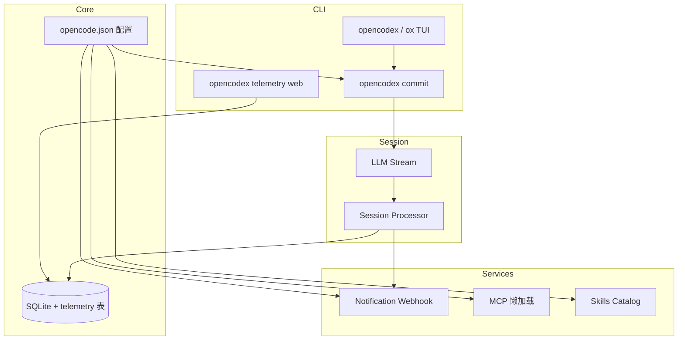

# OpenCodeX 变更说明

本文档基于 `dev` 分支从提交 `8864c612`（含）到 `8c7fa0f1`（HEAD）的 Git 历史整理，涵盖 7 个提交、74 个文件、约 5000+ 行新增代码。

## 提交概览

| 提交 | 类型 | 摘要 |
|------|------|------|
| `8864c612` | feat | 遥测、AI 提交信息生成、通知系统 |
| `be9e6bd9` | feat | MCP 懒加载、`include_tools`、Skills 目录模式 |
| `9633855b9` | feat | `commit --push` 与未暂存变更处理改进 |
| `9436822de` | feat | CLI 主题支持与 commit 输出样式 |
| `948d4bb6a` | feat | OpenCode → OpenCodeX 品牌重塑 |
| `bd2e1011c` | fix | 使用 `OPENCODE_ORIG_CWD` 解析线程目录 |
| `8c7fa0f1d` | feat | `task_interrupted` 通知事件与中止错误处理 |

---

## 1. 本地安装与开发环境

新增根目录脚本 `install-opencodex.sh`，一键完成开发环境搭建：

- 执行 `bun install --ignore-scripts` 安装依赖
- 生成 `packages/opencode/bin/opencodex-dev` 包装脚本，启动前设置 `OPENCODE_ORIG_CWD` 为调用时的工作目录
- 在 `~/bin` 创建 `opencodex` 与 `ox` 软链接

```bash
./install-opencodex.sh
opencodex   # 或 ox
```

开发版本号格式为 `dev-{version}+{sha}`（见 `packages/core/src/installation/source-version.ts`），便于区分源码构建与发布版本。

---

## 2. 遥测系统（Telemetry）

### 功能

在本地 SQLite 数据库中持久化性能与使用数据，并提供 Web 仪表盘实时查看。

**采集事件：**

| 事件 | 说明 |
|------|------|
| `llm.completion` | LLM 调用（token 用量、耗时、成本等） |
| `tool.used` | 工具调用 |
| `turn.completed` | 单轮对话完成 |
| `cli.start` / `cli.exit` | CLI 启动与退出 |

**接入点：** Session 处理器（`processor.ts`、`prompt.ts`）在 LLM 流式完成、工具执行、轮次结束时自动上报。

### CLI

```bash
opencodex telemetry web [--port 4312] [--hostname 127.0.0.1] [--interval 2000] [--open]
```

- 默认在 `http://127.0.0.1:4312` 启动仪表盘
- 支持深色/浅色主题切换
- 展示 LLM 调用统计、工具使用、轮次耗时等

### 禁用

设置环境变量 `OPENCODE_DISABLE_TELEMETRY=1` 或 `true` 可关闭采集。

### 数据库

新增迁移 `20260611113000_telemetry.ts`，在 `telemetry` 表中存储事件记录。

---

## 3. AI 提交信息生成（Commit）

### CLI 命令

```bash
opencodex commit [options]
```

| 选项 | 说明 |
|------|------|
| `--dir <path>` | 指定工作目录 |
| `--all` | 无暂存变更时，自动 stage 已跟踪文件 |
| `--include-untracked` | 无暂存变更时，包含未跟踪文件 |
| `--message <msg>` | 直接使用给定信息，跳过 AI 生成 |
| `--previous <msg>` | 重新生成时排除的上一条信息 |
| `--yes` | 跳过确认直接提交 |
| `--push` | 提交后推送到远程；无变更时可选择仅 push |
| `--dry-run` | 仅预览，不创建提交 |

**交互流程：** 分析 git 状态 → AI 生成 Conventional Commits 格式信息 → 预览（提交/编辑/重新生成/取消）→ 执行 `git commit`，可选 `git push`。

**未暂存变更处理：**

- `--yes` 或 `--push` 在无 staged 文件时自动启用 `--all` 行为
- 锁文件（如 `package-lock.json`）单独变更会被排除并提示
- 无可用变更时，`--push` 可触发「是否推送当前分支」确认

### TUI 插件

内置 TUI 插件 `internal:opencode-commit`（`packages/opencode/src/plugin/tui/commit.tsx`），在终端 UI 中提供与 CLI 等价的提交交互（对话框预览、编辑、确认）。

### 配置

在 `opencode.json` 中可配置：

```json
{
  "commit_message": {
    "prompt": "自定义 system prompt（完全替换默认 Conventional Commits 提示）",
    "model": "anthropic/claude-haiku-4-5"
  }
}
```

- `model` 未设置时回退到 `small_model`，再回退到默认 `model`
- 基于 git diff 上下文生成，支持 monorepo scope 推断

---

## 4. 通知系统（Webhook）

### 功能

监听 Session 状态、权限请求、问答等事件，通过 Webhook 推送通知（默认适配飞书机器人 JSON 格式）。

**支持的事件：**

| 事件 | 触发场景 |
|------|----------|
| `task_completed` | 任务正常完成（busy → idle） |
| `task_error` | 执行出错 |
| `task_interrupted` | 用户中止（`MessageAbortedError`） |
| `permission_required` | 需要权限确认 |
| `question_required` | 需要用户回答 |
| `session_error` | 会话级错误 |

通知内容包含：项目名、终端名、Session 标题、最近用户消息摘要、时间戳。

### 配置

```json
{
  "notification": {
    "enabled": true,
    "webhookUrl": "https://open.feishu.cn/open-apis/bot/v2/hook/...",
    "notify_action": "webhook",
    "enabled_events": ["task_completed", "task_error", "task_interrupted"],
    "disabled_events": []
  }
}
```

- `enabled_events`：白名单；未设置时使用全部默认事件
- `disabled_events`：黑名单，优先级高于白名单
- 终端类 Session（有 `parentID`）的完成/错误/中断事件会被跳过，避免子任务重复通知
- 终态通知有 1 秒防抖与 5 秒去重

### 接入

`opencodex serve` 与 TUI worker 启动时自动调用 `setupNotification()`。

---

## 5. MCP 增强

### 懒加载（`lazy`）

MCP 服务器可配置 `lazy: true`，启动时不连接，状态为 `idle`，仅在以下时机按需连接：

- `mcp_connect` 工具调用
- `opencodex mcp connect <name>` CLI
- TUI `/mcp connect` 命令

适用于工具较多或不常使用的 MCP 服务，减少启动开销。

### 工具过滤（`include_tools`）

`include_tools: false` 时保持连接，但不将工具 schema 注入 LLM 请求，降低 token 消耗。默认 `true`。

### Profile 过滤

通过 `mcp_profile` 与 `mcp_profiles` 按 profile 名称筛选启用的 MCP 服务器。

### 状态显示

MCP 状态新增 `idle` 指示，区分已配置未连接与已连接服务器。

---

## 6. Skills 目录模式

在 `skills.catalog` 中控制技能列表如何注入系统提示：

| 模式 | 行为 |
|------|------|
| `compact`（默认） | 注入技能名与描述，省略文件路径 |
| `verbose` | 包含完整路径信息 |
| `none` | 不写入系统提示，将目录移至 `skill` 工具描述中 |

适用于控制 context 长度与技能可发现性的平衡。

---

## 7. CLI 主题支持

新增 `packages/opencode/src/cli/theme.ts`，CLI 命令（尤其 `commit`）复用 TUI 主题配色：

- 从项目 `.opencode` 目录向上查找主题配置
- 支持 TUI 主题 JSON 与内置主题
- 尊重 `NO_COLOR` 环境变量
- commit 输出区分：成功（绿）、信息（灰）、警告、危险等语义色

---

## 8. 品牌重塑：OpenCode → OpenCodeX

TUI 全面更新品牌标识：

- 终端标题：`OpenCode` → `OpenCodeX`
- 版本徽章：`Code` → `CodeX`
- 音效包：`OpenCodeX Default`
- 提示文案与权限对话框引用 OpenCodeX
- Logo ASCII 艺术字更新，统一从 `packages/tui/src/logo.ts` 导入

---

## 9. 工作目录修复（OPENCODE_ORIG_CWD）

**问题：** 通过 `opencodex-dev` 启动时，进程 `cwd` 被切换到 `packages/opencode`，导致 TUI 线程目录解析错误。

**修复：**

- 包装脚本设置 `OPENCODE_ORIG_CWD="$(pwd)"` 记录用户实际工作目录
- `resolveThreadDirectory()` 优先使用 `OPENCODE_ORIG_CWD`
- `invocationDirectory()` 用于 `commit --dir` 等相对路径解析

---

## 10. 日志增强

`packages/core/src/util/log.ts` 扩展结构化日志能力，为遥测、通知、提交信息等模块提供统一日志服务。

---

## 配置示例（汇总）

```json
{
  "commit_message": {
    "model": "anthropic/claude-haiku-4-5"
  },
  "notification": {
    "enabled": true,
    "webhookUrl": "https://example.com/webhook",
    "enabled_events": ["task_completed", "task_interrupted"]
  },
  "skills": {
    "catalog": "compact"
  },
  "mcp": {
    "my-server": {
      "type": "local",
      "command": ["npx", "-y", "some-mcp-server"],
      "lazy": true,
      "include_tools": true
    }
  }
}
```

---

## 测试覆盖

本区间新增/扩展测试：

| 模块 | 测试文件 |
|------|----------|
| 遥测 | `telemetry/query.test.ts`、`server.test.ts`、`setup.test.ts` |
| 提交 | `commit-command.test.ts`、`commit-message/generate.test.ts`、`git-context.test.ts` |
| 通知 | `notification/webhook.test.ts` |
| MCP | `mcp/lifecycle.test.ts` |
| CLI 主题 | `cli/theme.test.ts` |
| TUI 线程目录 | `cli/tui/thread.test.ts` |
| TUI 提交插件 | `plugin/tui-commit-plugin.test.ts` |
| Skills 系统提示 | `session/system.test.ts` |

---

## 架构关系



---

## 版本信息

- **分析范围：** `8864c612` … `8c7fa0f1`（`dev` 分支）
- **生成日期：** 2026-06-12
- **变更规模：** 74 files changed, +5055 / -69 lines
